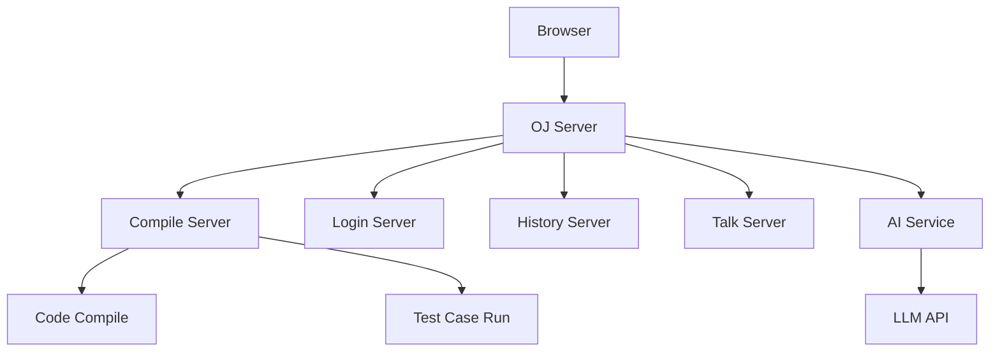
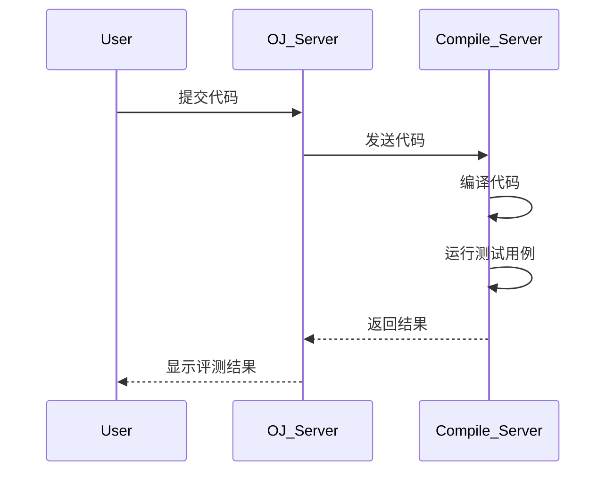

# 🧠 Online Judge System

> 一个集 **在线判题 + 技术论坛 + AI问答** 于一体的算法学习平台

# 📖 项目简介

**Online Judge System** 是一个基于 **C++ + Python + HTTP 服务架构**实现的在线判题平台。

系统不仅支持 **算法题在线评测（Online Judge）**，还集成了：

* 🧑‍💻 用户系统
* 💬 技术论坛
* 🤖 AI问答助手

构建了一个 **算法练习 + 技术交流 + AI辅助学习** 的综合平台。

该项目采用 **模块化设计 + 多服务架构**，实现代码编译、运行评测、用户管理、论坛交流和 AI 问答等功能。

---

# ✨ 项目特点

* 🧠 在线算法题评测系统
* ⚡ C++代码自动编译运行
* 👤 用户系统与提交记录
* 💬 技术论坛交流社区
* 🤖 AI 问答接口扩展
* 🧩 模块化系统架构
* 🔌 可扩展微服务设计

适用于：

* 算法学习平台
* OJ系统教学示例
* 毕业设计项目
* 后端系统架构实践

---

# 🧭 项目目录

```
OnlineJudge
│
├── comm/                 公共模块
│   ├── httplib.h
│   ├── util.hpp
│   └── log.hpp
│
├── compile_server/       代码编译运行服务
│   ├── compile_server.cc
│   ├── compiler.hpp
│   └── compile_run.hpp
│
├── oj_server/            OJ核心服务
│   ├── app.py
│   ├── judgeadmin.hpp
│   └── apiutil.hpp
│
├── login/                用户登录模块
│   └── login.cc
│
├── history/              提交历史记录
│   └── history.cc
│
├── talk/                 技术论坛
│   └── talk.cc
│
├── weather/              AI服务接口
│   └── app.py
│
├── api/                  API接口
│
├── testhttp/             HTTP测试模块
│
└── README.md
```

---

# 🏗 系统架构

系统采用 **服务拆分架构**：



---

# ⚙️ 判题流程



---

# 🧩 功能模块

## 1 在线判题系统

核心功能：

* 浏览题目
* 在线提交代码
* 自动编译运行
* 判题结果返回

支持结果：

* Accepted
* Wrong Answer
* Compile Error
* Runtime Error
* Time Limit Exceeded

---

## 2 用户系统

提供用户管理功能：

* 用户注册
* 用户登录
* 提交历史记录
* 用户提交统计

---

## 3 技术论坛

社区交流模块：

* 发布帖子
* 浏览帖子
* 技术讨论
* 算法题解交流

---

## 4 AI问答

AI接口支持：

* 编程问题咨询
* 算法题讲解
* 技术学习辅助

未来可接入：

* ChatGPT
* DeepSeek
* 本地大模型

---

# 🛠 技术栈

| 技术       | 说明     |
| -------- | ------ |
| C++      | 核心服务开发 |
| Python   | AI接口   |
| HTTP     | 服务通信   |
| HTML     | 前端页面   |
| Makefile | 构建工具   |

核心库：

```
cpp-httplib
```

---

# 🚀 快速启动

## 1 克隆仓库

```
git clone https://github.com/yourname/online-judge-system.git
cd online-judge-system
```

---

## 2 启动 Compile Server

```
cd compile_server
make
./compile_server
```

---

## 3 启动 OJ Server

```
cd oj_server
make
./oj_server
```

---

## 4 启动用户系统

```
cd login
make
./login
```

---

## 5 启动历史记录服务

```
cd history
make
./history
```

---

## 6 启动论坛服务

```
cd talk
make
./talk
```

---

## 7 启动 AI 服务

```
cd weather
python app.py
```

---

# 🌐 访问系统

浏览器访问：

```
http://localhost:8080
```

即可使用：

* 在线刷题
* 提交代码
* 查看结果
* 浏览论坛
* AI问答

---
# 📊 性能评测（Performance Evaluation）

## 一、实验背景

针对在线判题系统中**编译服务高并发调度问题**，本文设计并实现了一种基于 **CPU 利用率、内存占用和任务数的加权负载均衡策略**，并通过对比实验验证其性能优势。

---

## 二、实验方案

### 压测与监控工具

- 压测工具：Apache JMeter  
- 数据存储：InfluxDB  
- 可视化分析：Grafana  

---

## 三、测试设计

- 并发规模：**9 / 99 / 999 / 9999 请求**  
- 请求类型：
  - 编译失败
  - 运行错误
  - 正确执行
- 压测方式：**瞬时并发（Ramp-up = 0）**  
- 核心指标：
  - 平均响应时间
  - 错误率  

---

## 四、对照策略

为验证算法有效性，选取以下典型调度策略进行对比：

- **单主机（Single Node）**：无负载均衡  
- **随机调度（Random）**：随机分配请求  
- **轮询调度（Round Robin）**：顺序分配请求  
- **加权调度（Weighted，本项目）**：  
  基于 CPU、内存利用率及任务数计算节点负载并动态选择  

---

## 五、核心结果（高并发：9999 请求）

| 策略 | 平均响应时间 | 错误率 |
|------|--------------|--------|
| 单主机 | 2771s+ | 9.1% |
| 随机 | ~2540s | 0% |
| 轮询 | ~2532s | 0% |
| **加权策略（本项目）** | **1716s** | **0%** |

---

## 六、结果分析

- **单主机方案**：高并发下出现明显性能瓶颈，并产生错误请求  
- **随机 / 轮询策略**：能够分散请求压力，但缺乏对节点真实负载的感知能力  
- **加权策略（核心优化）**：
  - 动态感知节点负载（CPU / 内存 / 任务数）
  - 避免将请求分配至高负载节点
  - 在高并发场景下显著降低响应时间（约提升 30%+）

---

## 七、结论

> 本项目提出的**资源感知加权负载均衡策略**，在高并发场景下显著优于传统调度方法，在保证 0% 错误率的同时，大幅降低系统响应时间，提升整体稳定性与吞吐能力。

---

## 八、进一步优化方向

- 动态权重调整（自适应 CPU / 内存占比）  
- 引入节点健康检查与故障剔除机制  
- 支持更大规模分布式调度（多机部署）  

---

## 🚀 总结

> 相比传统轮询与随机策略，本项目通过引入资源感知的加权调度机制，使在线判题系统在高并发场景下性能提升约 **30%+**，并保持稳定无错误运行。


# 🔭 项目 Roadmap

未来计划扩展：

### 代码安全

* Docker沙箱执行代码

### 多语言支持

增加：

* Python
* Java
* Go

### AI题解系统

结合大模型：

* 自动生成题解
* 代码分析
* 算法讲解

### 向量数据库

实现：

* 题库语义搜索
* RAG题解系统

### 前端升级

升级为：

* Vue
* React

---

# 🤝 贡献指南

欢迎贡献代码！

步骤：

```
Fork 项目
创建分支
提交代码
发起 Pull Request
```

---

# 📄 License

MIT License

---

# 👨‍💻 作者

Online Judge System
算法学习与在线评测平台

---

# ⭐ 如果这个项目对你有帮助

欢迎给项目一个 **Star ⭐**
